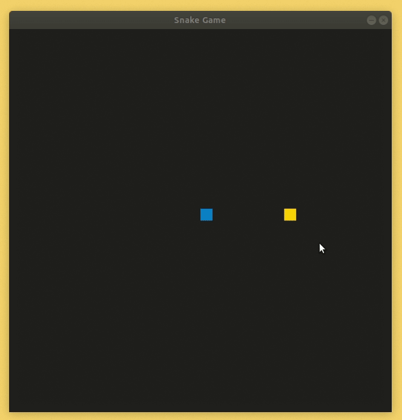

# CPPND: Capstone Snake Game

This is  the Capstone project in the [Udacity C++ Nanodegree Program](https://www.udacity.com/course/c-plus-plus-nanodegree--nd213). The code for this repo was inspired by [this](https://codereview.stackexchange.com/questions/212296/snake-game-in-c-with-sdl) excellent StackOverflow post and set of responses.

In this project I extended the [Snake Game](https://github.com/udacity/CppND-Capstone-Snake-Game) by following the principles I learned throughout the c++ Nanodegree Program. See [Rubric Points](#rubric-points)

## New Features
* Pause
  * Game can be **paused/resumed** by pressing `ESC` button.  

* There is a **wall** option available. 
  * Pressing the `w` key will enable/disable the wall around the game table. 
  * Snake can't appear on the other side of the screen if the wall is active and this will result the death of the snake.

* Modal box added
  * When you die, a small dialog box appears and shows score and size informations. Console output is still available

* Toxic Foods
  * There is a 20% chance for a toxic food.
  * Toxic foods are unidentified until eaten and if snake eats a toxic food it will be poisoned for 5 seconds.
  * Poisoned snake will go in opposite direction. For ex. pressing *UP* key will result to go *DOWN*. This effect will last for 5 seconds.

## Dependencies for Running Locally
* cmake >= 3.7
  * All OSes: [click here for installation instructions](https://cmake.org/install/)
* make >= 4.1 (Linux, Mac), 3.81 (Windows)
  * Linux: make is installed by default on most Linux distros
  * Mac: [install Xcode command line tools to get make](https://developer.apple.com/xcode/features/)
  * Windows: [Click here for installation instructions](http://gnuwin32.sourceforge.net/packages/make.htm)
* SDL2 >= 2.0
  * All installation instructions can be found [here](https://wiki.libsdl.org/Installation)
  * Note that for Linux, an `apt` or `apt-get` installation is preferred to building from source.
* gcc/g++ >= 5.4
  * Linux: gcc / g++ is installed by default on most Linux distros
  * Mac: same deal as make - [install Xcode command line tools](https://developer.apple.com/xcode/features/)
  * Windows: recommend using [MinGW](http://www.mingw.org/)

## Basic Build Instructions

1. Clone this repo.
2. Make a build directory in the top level directory: `mkdir build && cd build`
3. Compile: `cmake .. && make`
4. Run it: `./SnakeGame`.

## Rubric Points

### Loops, Functions, I/O
The project code is clearly organized into functions and classes. All reusable codes implemented as function in order to prevent copy-paste codes.

Project accept user inputs during the game, these inputs are used by controlling the snake and other game features such as pausing and triggering the wall.

### Object Oriented Programming
The project code is organized into classes with class attributes to hold the data, and class methods to perform tasks.

All class data members are explicitly specified as public, protected, or private.

THe project make use of friend classes.

All class methods are commented about their functionality.

### Memory Management
The project makes use of references in function declarations. Both references and pointers used all around the project.

### Concurrency
The project creates a thread each time snake is poisoned. This thread waits for 5 seconds and return back the snake's poisonous state to normal by modifying the game's private pointer variable.

